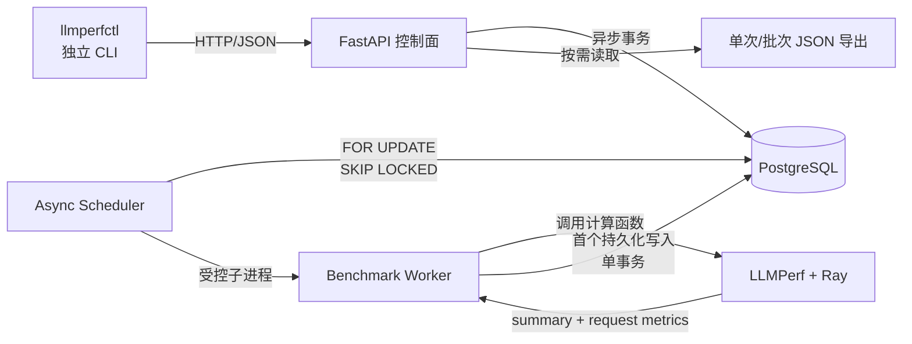
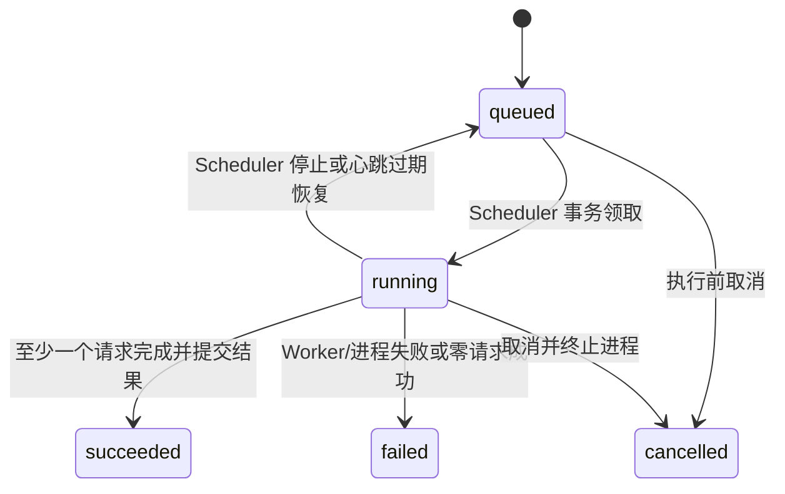
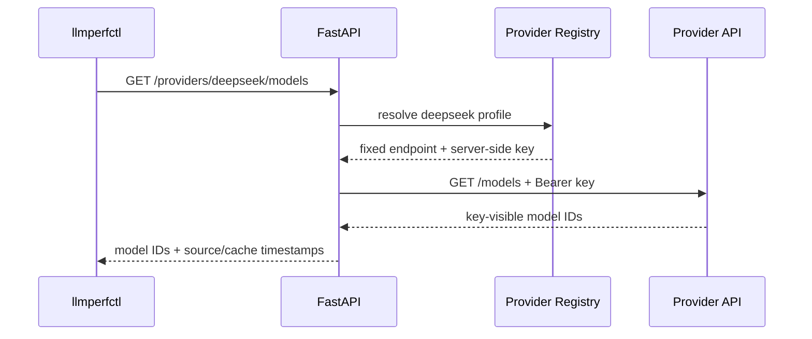

# LLMPerf 异步任务与数据持久化架构

KV Cache 外部观测的实验协议、P0 实施状态与数据字段演进方案见
[《LLMPerf 外部 KV Cache 可观测性技术报告》](KVCACHE_OBSERVABILITY_TECHNICAL_REPORT.zh-CN.md)。
地理时间周期派发的 RunnerPlan 领域模型、Planner 物化流程和 Scheduler 执行协议见
[《LLMPerf Runner Planner 架构设计》](RUNNER_PLANNER_ARCHITECTURE.zh-CN.md)。

## 1. 目标

本扩展将原始 LLMPerf 从“命令行运行后写出 JSON 文件”提升为可持久化、可恢复、可编排的实验系统，主要面向 GLM KVCache 命中率及性能指标调研。

核心原则如下：

- PostgreSQL 是任务、配置快照、汇总指标和逐请求指标的唯一事实来源。
- 后端管理的 Worker 不生成中间 JSON 结果文件。
- JSON 是按需生成的导出格式，不参与任务完成判定。
- FastAPI 只负责控制面和异步 I/O，不直接执行 Ray/LLM 压测。
- CLI 是独立 HTTP 客户端，不依赖后端、数据库或 Ray 实现。

## 2. 目录与职责

```text
llmperf/
├── src/
│   ├── llmperf/                 # 原始请求客户端、Ray Launcher、指标定义
│   ├── llmperf_backend/
│   │   ├── app.py               # FastAPI 生命周期与 REST 接口
│   │   ├── config.py            # safe_load、环境变量展开、原子配置重载
│   │   ├── models.py            # YAML 与 API 的 Pydantic 模型
│   │   ├── persistence.py       # SQLAlchemy Async ORM 与事务仓储
│   │   ├── providers.py         # 供应商配置、凭据隔离与模型发现
│   │   ├── scheduler.py         # Runner 领取、心跳、取消、Worker 监管
│   │   ├── worker.py            # 指标计算与数据库首写
│   │   └── configs/default.yaml # 默认运行配置
│   └── llmperf_cli/
│       ├── client.py            # 仅使用 HTTP 的轻量客户端
│       └── __main__.py          # llmperfctl 命令入口
├── examples/example-campaign.yaml # 多运行编排示例
└── tests/                        # 配置、API、仓储与 Runner 测试
```

## 3. 总体组件



API、Scheduler、Runner 和 Worker 是四个不同边界：

- API 是控制面：接受任务、查询状态、请求取消、导出数据。
- Scheduler 是调度面：常驻 backend、领取 queued Runner、监管 Worker。
- Runner 是持久化执行对象：保存 YAML 快照、状态、取消意图和结果。
- Worker 是一次性执行进程：为一个 Runner 调用 LLMPerf，提交结果后退出。

同一个 Runner 在 Scheduler 重启或心跳过期后可能先后产生多个 Worker 执行尝试，
但始终只有一个 `runner_id` 和一份受事务保护的最终结果。Worker 不是用户可直接
创建的资源，其 PID、退出码和日志作为 Runner 的运行时信息查询。

## 4. 领域标识

### Campaign

`campaign_id` 表示一次完整调研或实验批次，例如“DeepSeek 跨小时 KV Cache 保留曲线”。它保存名称、说明和标签，并关联即时 Runner、RunnerPlan，以及需要跨 Runner 交换状态的 Protocol Definition/Instance。

### Runner

每次任务执行生成一个不可重复 UUID，API 返回：

- `runner_id`：对外语义明确的运行标识。
- `label`：可选的人类可读名称，例如 `concurrency-4`，不作为主键。
- `campaign_id`：可选的实验批次归属。

导出文件名使用 `runner_id` 或 `campaign_id`，不会依赖模型名称、时间戳或用户标签来保证唯一性。

## 5. 数据模型

| 表 | 作用 | 关键字段 |
|---|---|---|
| `benchmark_campaigns` | 多次运行的实验分组 | `id`, `name`, `description`, `tags`, `created_at` |
| `benchmark_protocol_definitions` | Campaign 级高级协议定义与不可变 Runner 模板 | `id`, `campaign_id`, `protocol`, `config`, `runner_template` |
| `benchmark_protocol_instances` | 通用协议状态机实例 | definition, protocol, instance key, state, spec/checkpoint/outcome |
| `benchmark_runner_dispatches` | RunnerPlan 与协议实例共用的持久派发协议 | typed owner, role/key, `parent_dispatch_id`, blocked/pending/emitted, `due_at`, template |
| `benchmark_runners` | 单次运行及状态机 | `id`, `campaign_id`, `label`, `status`, `benchmark_config`, timestamps, heartbeat, process/log/error, `summary` |
| `benchmark_request_results` | 每个 LLM 请求的原始指标 | `runner_id`, `sequence`, `metrics` |
| `benchmark_runner_events` | 状态变化审计记录 | `runner_id`, `status`, `message`, `created_at` |
| `users` | 用户资料、用户级别及启停状态 | `username`, `display_name`, `email`, `role`, `enabled` |
| `trusted_client_keys` | 一个用户的一把或多把受信任公钥 | `key_id`, `username`, `public_key_pem`, `enabled`, `valid_until` |
| `trusted_client_events` | 用户与密钥管理审计 | `username`, `key_id`, `action`, `actor`, `created_at` |

任务创建时会复制完整 Benchmark 配置到 `benchmark_runners.benchmark_config`。之后即使默认 YAML 改变，历史运行仍能还原当时参数。

`summary` 和 `metrics` 在 PostgreSQL 中使用 JSONB 保留上游及 GLM 扩展指标，但它们属于数据库记录，而不是磁盘 JSON 文件。非有限浮点数会在入库前转换为 `null`，避免 PostgreSQL 拒绝非法 JSON 数值。

### 初始化数据库表

推荐由版本化 SQL 明确初始化表，而不是在稳定环境中依赖 ORM 自动建表：

```bash
psql -v ON_ERROR_STOP=1 \
  -d llmperf \
  -f sql/postgresql/init.sql
```

对应配置可关闭自动建表：

```yaml
database:
  url: "${DATABASE_URL:-postgresql+asyncpg:///llmperf}"
  auto_create_schema: false
```

初始化脚本不会插入超级用户。空 `users` 表下，配置文件中的 Bootstrap 公钥仍会把 `bootstrap_subject` 识别为虚拟 `superuser`，由它通过 CLI 创建首批数据库用户。

### PostgreSQL 集成测试

默认单元测试不连接开发数据库。若要运行真实 PostgreSQL 数据生命周期测试，先建立一个名称明确包含 `test` 的一次性数据库：

```bash
createdb llmperf_test
export LLMPERF_TEST_DB='postgresql+asyncpg:///llmperf_test'
pytest -q -m postgresql tests/test_sql.py tests/test_backend_app.py
```

测试会在该专用数据库内执行建表、Campaign/Runner 入库、任务领取、JSONB 指标提交、用户/公钥查询，最后删除测试创建的表。保护检查会拒绝重置名称不包含 `test` 的数据库。
如果没有显式设置 `LLMPERF_TEST_DB`，所有 `postgresql` 测试自动跳过；配置了非 `postgresql+asyncpg` URL 或数据库名称不包含 `test` 时则直接失败。

项目级 Pytest 配置要求测试函数名最多包含三个下划线分隔符。`tests/conftest.py` 在收集期强制执行此规则，并要求所有 `postgresql` 测试显式依赖统一的 `postgresql_url` fixture。

## 6. 状态机与并发控制



Scheduler 通过下面的数据库语义领取 Runner：

```sql
SELECT ...
FROM benchmark_runners
WHERE status = 'queued'
ORDER BY created_at
FOR UPDATE SKIP LOCKED
LIMIT 1;
```

因此多个 Scheduler 可以竞争队列，而不会重复领取同一 Runner。
`max_concurrent_runners` 控制每个 Scheduler 进程的并发槽位。

运行期间 Scheduler 定期更新 `heartbeat_at` 并读取 `cancel_requested`。超过
`stale_after_seconds` 的 Runner 可重新排队。成功提交和取消请求都会锁定同一
Runner 行，确保二者不会同时成为最终状态。

## 7. 执行与数据首写流程

```mermaid
sequenceDiagram
    participant C as CLI/API Client
    participant A as FastAPI
    participant D as PostgreSQL
    participant R as Scheduler
    participant W as Worker Process
    participant L as LLMPerf/Ray

    C->>A: POST /api/v1/runners
    A->>D: INSERT queued Runner + event
    R->>D: claim with SKIP LOCKED
    D-->>R: running Runner
    R->>W: python -m llmperf_backend.worker --runner-id ...
    W->>D: load immutable Runner configuration
    W->>L: execute benchmark calculation
    L-->>W: summary + individual metrics
    W->>D: lock Runner; INSERT metrics; UPDATE succeeded
    D-->>W: commit
    R->>D: persist bounded stdout/stderr
```

Worker 的计算结果先存在进程内存，首个持久化位置是 PostgreSQL。Summary 与全部逐请求指标在一个事务中提交；如果事务前已经请求取消，则拒绝成功提交。

Worker 退出码只表示执行进程是否正常。业务完成状态还检查请求结果：零成功请求
写为 `failed`，部分失败写为 `succeeded` 且
`summary.outcome.status=degraded`，全部成功才写为普通 `succeeded`。三种情况
都会在同一事务中保存 Summary 与逐请求指标；因此具有持久化结果的失败 Runner 也
允许导出诊断。

当前版本在一次运行结束后批量提交结果，不提供运行中逐请求指标的部分可见性。未来如果需要实时指标，应增加数据库批次写入协议和明确的 partial 状态，不能退回中间 JSON 文件方案。

## 8. JSON 导出边界

单次运行：

```http
GET /api/v1/runners/{runner_id}/export
GET /api/v1/runners/{runner_id}/logs
```

只允许导出 `succeeded` 的 Runner，文件包含固定运行配置、元数据、summary 和逐请求指标。

多次运行总结：

```http
GET /api/v1/campaigns/{campaign_id}/export
GET /api/v1/campaigns/{campaign_id}/export?include_requests=true
```

默认导出以下总结：

- Runner 总数及各状态数量。
- 所有已完成请求数量。
- 每个 Runner 的标签、配置、状态、summary 和错误信息。
- Cache Retention 协议定义、逐实例 checkpoint/outcome 和按 delay 聚合的 Provider
  命中概率、Token 命中率及 Prime/Warm/Cold-Control TTFT 差。

`include_requests=true` 才附带各 Runner 的逐请求指标，以避免大 Campaign 默认生成过大的文件。

## 9. CLI 架构与使用

`llmperfctl` 不导入后端包。它通过 `urllib` 调用 REST API，并使用 PyYAML 解析本地编排文件。CLI 默认读取 `~/.config/llmperf/cli.env`（设置 `XDG_CONFIG_HOME` 时使用其下的 `llmperf/cli.env`）；已经导出的进程环境变量优先于文件值。默认文件不存在是正常状态，也可以用 `LLMPERF_CLI_ENV_FILE` 显式选择其他文件。Backend 请求命令遇到显式文件不存在时立即报错，本地 `config` 命令仍可用于检查或创建该文件。服务地址默认为 `http://127.0.0.1:8000`，可以在 `cli.env` 中设置：

```bash
LLMPERF_URL=http://127.0.0.1:8000
LLMPERF_PRIVATE_KEY=/home/user/.ssh/id_rsa
```

推荐通过本地配置命令原子写入该文件；这些命令不连接 Backend：

```bash
llmperfctl config set LLMPERF_URL http://127.0.0.1:12666
llmperfctl config set LLMPERF_PRIVATE_KEY /home/user/.ssh/id_rsa
printf '%s' "$LLMPERF_TOKEN" | llmperfctl config set LLMPERF_TOKEN --stdin
llmperfctl config get LLMPERF_URL
llmperfctl config list
llmperfctl config path
llmperfctl config unset LLMPERF_TOKEN
```

配置目录和文件会分别使用 `0700`、`0600` 权限。命令行参数优先级最高，因此 `--url`、`--private-key` 等显式参数会覆盖进程环境和 `cli.env`；进程环境又优先于文件值。

未显式提供 `--token` 或 `--private-key` 时，CLI 默认扫描 `~/.ssh` 中权限安全、未加密且可解析的 RSA 私钥。候选顺序优先 `llmperfctl`、`id_rsa`，之后按文件名排列；只有服务返回 `401` 才尝试下一把，`403` 表示已认证但权限不足，不会继续尝试。可以通过 `--ssh-dir` 或 `LLMPERF_SSH_DIR` 改变目录，通过 `--no-key-discovery` 完全关闭发现。CLI 跳过公钥、known_hosts、SSH 配置、符号链接、权限对组/其他用户开放的文件以及非 RSA/加密私钥。

单次上传：

```bash
llmperfctl runner start -f runner.yaml --label concurrency-1
llmperfctl runner start -f runner.yaml --wait
llmperfctl runner status RUNNER_ID
llmperfctl runner status RUNNER_ID --summary
llmperfctl runner wait RUNNER_ID
llmperfctl runner list
llmperfctl runner list --status failed --limit 10
llmperfctl runner list --json
llmperfctl runner list --full
llmperfctl runner logs RUNNER_ID
llmperfctl runner cancel RUNNER_ID
llmperfctl runner export RUNNER_ID -o runner.json
```

`runner list` 默认显示紧凑表格，只包含状态、Runner ID、Provider/Model、成功/失败请求数、
创建时间和标签，默认最多 20 条。后端列表接口同样默认返回轻量投影，不携带完整
summary、stdout 或 stderr；`--json` 输出轻量 JSON，只有 `--full` 请求并显示完整 Runner。
CLI 与服务端使用单一严格列表契约。

Benchmark tokenizer 优先由每个 Runner 的 YAML 主动选择：

```yaml
benchmark:
  provider: aliyun
  model: glm-5.2
  tokenizer:
    source: huggingface
    id: THUDM/glm-4-9b-chat
    revision: main
    use_fast: true
```

API 在任务入队前通过 backend `TokenizerCache` 查找并下载 tokenizer，阻塞操作在线程
执行器中运行，不占用 FastAPI 事件循环。下载完成后 tokenizer 被保存到 backend 管理的
本地缓存，解析出的 commit revision 随完整 Benchmark 配置写入 Runner。Scheduler 启动子进程
时再次按该不可变配置命中缓存，并只通过环境变量向该 Worker 注入本地目录及 fast/slow
选择。Worker 始终使用 `local_files_only=True`，不会自行访问 Hugging Face。

backend 缓存目录默认为 `~/.cache/llmperf/tokenizers`，可以通过
`LLMPERF_TOKENIZER_CACHE` 修改；设置
`LLMPERF_TOKENIZER_OFFLINE=true` 后，API 只接受已经存在于服务端下载缓存中的
tokenizer。远程 tokenizer code 固定为不信任，避免 operator 提交 YAML 后在控制面或
Worker 中执行仓库代码。多个并发请求在进程内按 tokenizer key 合并查找，磁盘 artifact
通过临时目录原子发布。

受限网络环境可以设置 `LLMPERF_HUGGINGFACE_PROXY=http://proxy:port`。backend 将该共享
代理显式传给 tokenizer 和 dataset 的 Hugging Face HTTP/HTTPS 请求，因此不依赖桌面或
systemd service 是否继承系统代理设置；进程级 `HTTP_PROXY`、`HTTPS_PROXY` 和
`NO_PROXY` 仍然有效。

Runner 未声明 tokenizer 时使用 backend 默认的
`hf-internal-testing/llama-tokenizer`，并经过同一解析与缓存流程。

启动、等待、取消和导出命令默认不向 stdout 倾倒 Backend JSON；轮询期间只在状态变化
时向 stderr 打印 `queued/running/终态`。展示与查询统一由 CLI 最终渲染层处理：
`status --summary/list` 使用紧凑视图，`runner logs` 只调用专用日志投影接口并明确分隔 Worker
stdout/stderr，`--full` 才显示完整 Runner。失败或取消时 CLI 进程返回退出码 2，适合
脚本和 CI 判断。`--timeout` 只终止本地等待，不取消已经持久化的任务；任务可继续用
Runner ID 查询。Benchmark 的 `timeout_seconds` 会继续传递为模型 HTTP 请求时限。

完整 Campaign 编排：

```bash
llmperfctl campaign start \
  -f examples/example-campaign.yaml \
  --wait \
  -o result_outputs/glm-study.json
```

CLI 创建 Campaign 后，通过一个批量接口在服务端事务中上传所有即时 Runner、
RunnerPlan 和 Protocol Definition：全部接受或全部失败。Cache Retention 定义为每个
`delay × trial` 建立独立 Protocol Instance，并预装载 Prime `pending` 与 Warm/Control `blocked`
Dispatch。Prime 成功提交结果时在同一事务中发布 Prompt Hash、UTC 锚点和
`warm_due_at`，并把直接子 Dispatch 解锁为 `pending`。Planner 只查询通用的到期 Dispatch
并物化普通 Runner，不查询或解释 Protocol Instance；长时间等待不占 Scheduler slot 或 Worker。CLI 进程退出不会造成
任务丢失，因为任务已经持久化在 PostgreSQL 中。

Campaign 聚合状态分为两个正交维度。`status` 只表达派发生命周期：
`planned/queued/running/paused/completed/cancelled`；`outcome` 表达 Runner
结果：`pending/succeeded/partial_failed/failed/cancelled/no_runs`。因此某一轮
失败不会把已经完成派发的 Campaign 生命周期标成 `failed`。例如 8 轮中 7 轮成功、
1 轮失败时返回 `status=completed, outcome=partial_failed`。这两个字段由 Runner 与
RunnerPlan recurrence 和 Protocol Instance 父子调用都编译到同一个 Durable Dispatch
协议。前者推进 occurrence cursor，后者由父调用完成事件解锁子调用；Planner 只执行
`pending && due_at <= now` 的幂等物化。RunnerPlan、Dispatch 与 Protocol Instance 的持久化状态实时聚合；处于 `active` 等待期的实例会让
Campaign 保持 `planned`，不会在 Warm 物化前误报完成。

Cache Retention Sweep 使用 `cache-retention/v1` 协议。每个 delay 点使用独立 Prompt
family，避免较早 Warm 刷新较晚 TTL 样本；Prime/Warm 的 Prompt SHA-256 必须一致。
导出横轴同时保留计划 delay 和由跨进程 UTC 时间计算的实际 delay。Cold Control 使用
独立 seed，并按实例确定性随机化 Warm/Control 顺序，用于降低长时间跨度上的负载漂移。

连续观测使用 `cache-residency/v1` 协议插件。插件先把时间表编译成稳定 mapping keys，
再生成一个包含多个独立请求的 Prime bundle，以及一条严格串行的
`Prime -> Observation-0 -> ... -> Observation-N` 派生调用链。每个 Warm 在模板中直接
携带与 Prime 请求相同的 mapping key；运行时只校验 key 对应的 Prompt Hash，不计算
位置索引。每个观测点的 Cold Control 使用独立 Prompt。

协议支持两种有界时间表：`relative` 以 Prime bundle 实际完成时间加 offsets 计算
`due_at`；`geographic` 使用 `timezone + starts_at + every_seconds + duration_days` 展开
绝对触发时间。例如三天、每小时一次会在提交事务中展开为 72 个观测点。地理时间控制
在哪个业务小时段触发，缓存年龄仍从 Prime bundle 实际完成时间计算。

协议插件位于 `llmperf_backend.protocols`，通过注册表按协议名选择纯编译器；Repository
只把通用 Instance/Dispatch Blueprint 写入 PostgreSQL。所有后继 Dispatch 在 Campaign
创建事务中预装载并通过 `parent_dispatch_id` 串联。
Prime 完成事务发布 Prompt Hash 和时间锚点、计算相对时间表的 `due_at`，并只解锁直接
子调用；每个后继成功后以相同方式解锁下一阶段。失败会取消尚未派发的后继。Planner
仍然只消费 `pending && due_at <= now()`，不会识别时间表类型、Prime、Warm 或 Control。
该协议的分析结论明确标记为 `access_conditioned_residency`，不得与无中间访问的被动
TTL 曲线合并。

查询后端已配置的供应商及其模型目录：

```bash
llmperfctl provider list
llmperfctl provider models deepseek
llmperfctl provider models deepseek --refresh
```

普通查询允许使用缓存；`--refresh` 强制向供应商重新探测，因此要求
`operator` 角色。

## 10. YAML 与运行配置

默认配置位于 `src/llmperf_backend/configs/default.yaml`，可通过环境变量覆盖。
测试服务器及长期部署推荐使用持久化用户配置：

```bash
llmperf-backend config set LLMPERF_SERVER_HOST 0.0.0.0
llmperf-backend config set DATABASE_URL postgresql+asyncpg:///llmperf
llmperf-backend config set LLMPERF_DATASET_CACHE /var/cache/llmperf/datasets
printf '%s' "$ALIYUN_API_KEY" | \
  llmperf-backend config set LLMPERF_PROVIDER_ALIYUN_KEY --stdin
llmperf-backend
```

默认写入 `~/.config/llmperf/backend.env`（设置了 `XDG_CONFIG_HOME` 时使用
其下的 `llmperf/backend.env`），与 CLI 推荐的认证密钥目录共享
`~/.config/llmperf` 根目录。目录权限为 `0700`，配置文件权限为 `0600`，
写入使用原子替换；`config get/list` 会隐藏密钥、令牌和数据库 URL。
配置修改后需要重启后端。

加载优先级为：已经导出的进程环境变量 > `LLMPERF_ENV_FILE` 指定文件 >
用户持久化配置 > 当前工作目录 `.env`。项目内 `.env` 仅作为兼容后备：

```bash
cp .env.template .env
# 修改 .env 中的数据库、模型服务和密钥配置
llmperf-backend
```

需要使用其他文件时，在启动前设置：

```bash
export LLMPERF_ENV_FILE=/absolute/path/llmperf.env
llmperf-backend
```

默认 `.env` 不存在时服务仍可启动；显式指定的 `LLMPERF_ENV_FILE` 不存在时启动失败，避免生产环境静默使用错误配置。dotenv 只在进程启动/配置读取时装载，修改后应重启服务。Runner 创建的 Worker 与 Ray Actor 继承已解析的模型服务变量。

也可以直接指定另一份 YAML：

```bash
export LLMPERF_BACKEND_CONFIG=/absolute/path/backend.yaml
export DATABASE_URL='postgresql+asyncpg:///llmperf'
llmperf-backend
```

配置使用 `yaml.safe_load`，支持：

- `${NAME}`：必须存在的环境变量。
- `${NAME:-default}`：带默认值的环境变量。

配置重载先完成解析和 Pydantic 校验，再原子替换内存配置。Benchmark 默认值会立即用于新建 Runner；数据库连接池、Runner 和 Server 参数需要重启进程。

### 供应商、密钥与模型选择解耦

供应商配置只存在于后端环境中。任务 YAML 只提交稳定的供应商标识和模型名：

```yaml
label: deepseek-smoke
benchmark:
  provider: deepseek
  model: deepseek-chat
  timeout_seconds: 30
  max_completed_requests: 1
  concurrent_requests: 1
  mean_input_tokens: 64
  stddev_input_tokens: 0
  mean_output_tokens: 16
  stddev_output_tokens: 0
```

后端 `.env` 则绑定执行协议、服务地址与凭据：

```dotenv
LLMPERF_PROVIDER_DEEPSEEK_URL=https://api.deepseek.com/v1
LLMPERF_PROVIDER_DEEPSEEK_KEY=replace-with-real-key
LLMPERF_DEFAULT_PROVIDER=deepseek
LLMPERF_DEFAULT_MODEL=deepseek-chat
```

OpenAI-compatible Profile 默认使用 `openai` Adapter、`/models` 发现路径和
300 秒缓存，因此常规供应商只需要 `URL` 与 `KEY`。任务负载参数保留在 Runner
YAML 中，不再复制到 `.env`。如果供应商不是 OpenAI-compatible，可增加
`ADAPTER`；存在 `MODELS` 时会自动使用静态目录。只有非标准服务才需要配置
`DISCOVERY`、`PATH`、`TTL`、`URLVAR` 或 `KEYVAR`。

创建 Runner 时，服务端验证 `provider` 是否存在，并用 Profile 中的
`llm_api` 覆盖客户端值。数据库仅保存 `provider`、`model` 和解析后的非敏感
Benchmark 参数；API key 与 API base 不进入任务、指标或 JSON 导出。Runner
启动 Worker 前清除全部 `LLMPERF_PROVIDER_*` 变量和其他 Profile 的目标凭据
变量，再只注入当前任务所选 Profile 的 endpoint/key。

Profile 在进程启动时从环境构建为只读注册表。修改 `.env` 中的 Profile、
密钥或模型发现策略后必须重启后端；`POST /config/reload` 只重载 YAML，不会
热更新凭据。

### 基于 API key 的模型发现

“仅凭 API key”无法跨供应商通用发现模型，还必须知道供应商协议和固定服务
地址。本架构不允许 CLI 上传任意 URL/key，而是只允许它引用后端 Profile：



- `DISCOVERY=openai`：请求 Profile 的
  `<URL><PATH>`，解析 OpenAI-compatible `data[].id`。
- `DISCOVERY=static`：对不提供兼容目录接口的供应商返回管理员配置的
  `MODELS` 白名单。
- `DISCOVERY=disabled`：禁止该 Profile 的模型发现。
- 结果按 Profile 的 TTL 缓存在单个 FastAPI 进程内；`refresh=true` 可绕过缓存。
- 返回值绝不包含 API key，只报告模型 ID、来源以及缓存时间。

模型目录表示“该 key 能看到这些模型”，不等价于模型一定可调用、账户有足够
额度或指定采样参数可用。若需要更强验证，应另建仅限 operator 的主动推理探针，
显式限制 token/频率、记录审计，并提示它可能计费。多 FastAPI 实例需要共享
缓存时，应把目录快照迁移至 PostgreSQL 或 Redis；当前内存缓存是轻量单实例方案。

## 11. API 概览

| 方法 | 路径 | 用途 |
|---|---|---|
| `GET` | `/health` | 服务与数据库健康检查 |
| `GET` | `/api/v1/scheduler/status` | 查询 Scheduler 状态与并发槽位 |
| `GET` | `/api/v1/providers` | 查询已配置供应商（不返回密钥） |
| `GET` | `/api/v1/providers/{id}/models` | 查询或刷新 key 可见模型目录 |
| `POST` | `/api/v1/campaigns` | 创建实验批次 |
| `GET` | `/api/v1/campaigns` | 查询实验批次 |
| `GET` | `/api/v1/campaigns/{id}` | 查询 Campaign 聚合状态 |
| `POST` | `/api/v1/campaigns/{id}/cancel` | 取消 Campaign 中未完成的 Runner |
| `POST` | `/api/v1/campaigns/{id}/runners` | 在单事务中批量启动 Runner |
| `GET` | `/api/v1/campaigns/{id}/export` | Campaign 总结导出 |
| `POST` | `/api/v1/runners` | 创建持久化 Runner |
| `GET` | `/api/v1/runners` | 分页/按状态查询 Runner |
| `GET` | `/api/v1/runners/{id}` | 查询单次运行状态 |
| `POST` | `/api/v1/runners/{id}/cancel` | 请求取消 |
| `GET` | `/api/v1/runners/{id}/results` | 查询数据库结果 |
| `GET` | `/api/v1/runners/{id}/events` | 查询状态审计记录 |
| `GET` | `/api/v1/runners/{id}/export` | 单次 JSON 导出 |

FastAPI 自动生成的 OpenAPI 页面位于 `/docs`。

## 12. 部署与工程化注意事项

- PostgreSQL 数据目录应位于 WSL Linux 文件系统，不应放在 `/mnt/c`。
- 应用数据库角色只需拥有 `llmperf` 数据库，不应授予 `SUPERUSER`。
- 数据库 URL 通过环境变量提供；配置查询接口会隐藏密码。
- Worker 数据库 URL 通过子进程环境传递，不出现在命令参数中，并在启动 Ray 前从 Ray runtime 环境移除。
- stdout/stderr 仅保留末尾 `log_bytes_limit` 字节，防止日志无限增长。
- 当前 `auto_create_schema` 适合全新开发数据库；`create_all` 不会升级已有表。进入稳定部署前应引入 Alembic 迁移。
- `/api/v1` 使用固定 PEM 公钥验证短时效 RS256 JWT；`/health` 保持公开，便于本地健康检查。
- 服务端只部署公钥，受信任的 `llmperfctl` 保存私钥并自动刷新短期令牌。私钥权限必须为 `0600`。
- JWT 是签名而非加密；远程访问时仍必须使用 HTTPS，防止短期 Bearer Token 被窃取和重放。

### 固定公钥认证配置

生成一对专用于 LLMPerf CLI 的密钥，不要复用 SSH 密钥：

```bash
mkdir -p ~/.config/llmperf/keys
openssl genpkey -algorithm RSA \
  -pkeyopt rsa_keygen_bits:3072 \
  -out ~/.config/llmperf/keys/ctl-private.pem
chmod 600 ~/.config/llmperf/keys/ctl-private.pem
openssl pkey \
  -in ~/.config/llmperf/keys/ctl-private.pem \
  -pubout \
  -out ~/.config/llmperf/keys/ctl-public.pem
```

后端 YAML：

```yaml
auth:
  enabled: true
  public_key_path: /home/xffan2/.config/llmperf/keys/ctl-public.pem
  algorithm: RS256
  issuer: llmperfctl
  audience: llmperf-api
  leeway_seconds: 5
```

CLI：

```bash
export LLMPERF_PRIVATE_KEY=~/.config/llmperf/keys/ctl-private.pem
llmperfctl health
llmperfctl campaign start -f examples/example-campaign.yaml --wait
```

`issuer` 和 `audience` 如有修改，CLI 的 `LLMPERF_AUTH_ISSUER` 与 `LLMPERF_AUTH_AUDIENCE` 必须保持一致。

## 13. 后续演进建议

1. 引入 Alembic，建立可审计的 schema 版本升级流程。
2. 增加 API 身份认证、Campaign/Runner 权限和密钥轮换。
3. 为长任务增加逐请求批量落库、进度字段和 partial 指标语义。
4. 针对 KVCache 增加规范化指标列或物化视图，保留原始 JSON 指标作为证据。
5. 增加 PostgreSQL 集成测试，覆盖多 Runner 竞争、崩溃恢复和取消/完成竞态。
