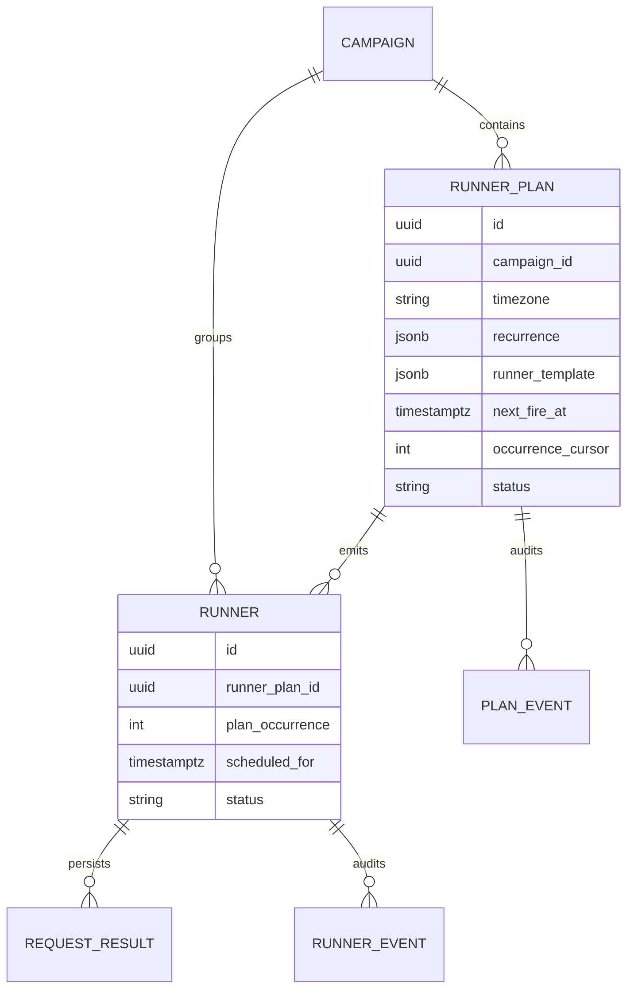
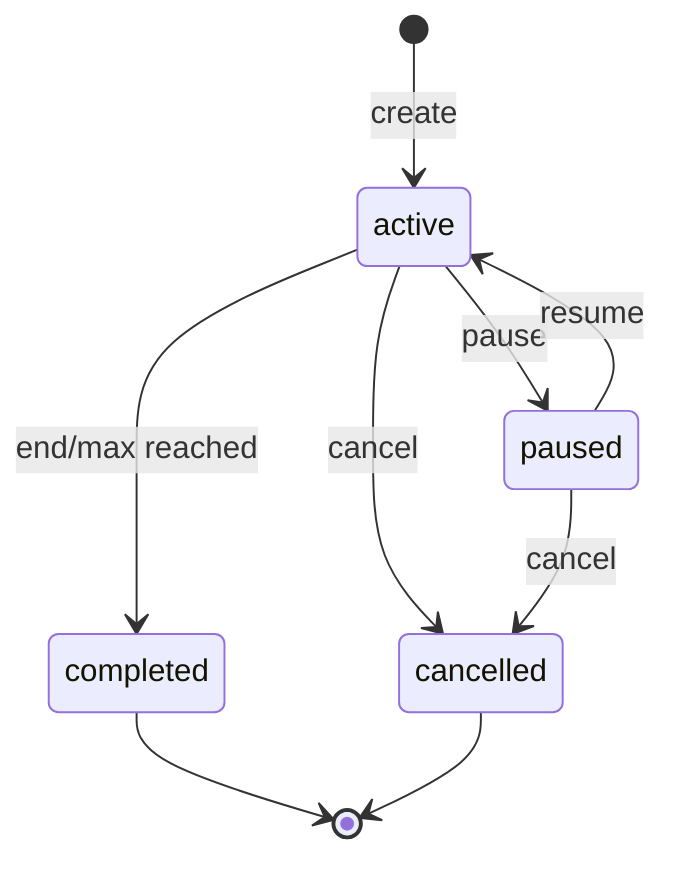
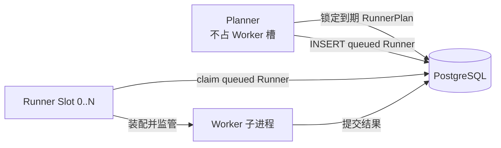

# LLMPerf Runner Planner 架构与实现

> 状态：核心链路已实现，指标与告警待补充  
> 日期：2026-08-13  
> 适用范围：Backend、Scheduler、PostgreSQL、`llmperfctl`  

## 1. 结论

重构前系统不能原生按照地理时间周期派发 Runner。现在保留原有
Runner/Worker 执行链，并由新的 Runner 产生层提供地理时间周期派发。

目标架构引入独立、轻量、持久化的 `RunnerPlan`，以及负责物化计划的 `Planner`：

- RunnerPlan 保存地理时区、周期规则、时间边界和不可变 Runner 模板；
- Planner 是不占 Worker 槽位的计划物化协程；
- Planner 在计划到期后生成一个普通、一次性的 queued Runner；
- Runner 仍然是唯一能被领取并装配 Worker 的执行对象；
- 所有地理时间规则按 IANA 时区解释，数据库查询时间统一保存为 UTC；
- PostgreSQL 事务、`FOR UPDATE SKIP LOCKED` 和唯一约束保证多 Planner 幂等；
- 等待下一周期的 RunnerPlan 不占用 Runner 槽位、Worker、Ray 或 Provider 连接。

这是一个有界周期派发器，不是通用 Cron 服务或工作流引擎。

### 1.1 命名规范

| 名称 | 类型 | 唯一职责 |
|---|---|---|
| `RunnerPlan` | 持久化领域对象 | 保存时间规则、Runner 模板和派发游标 |
| `Planner` | Backend 运行组件 | 把到期 RunnerPlan 物化为 queued Runner |
| `Scheduler` | Backend 运行组件 | 领取 queued Runner，装配并监管 Worker |
| `Runner` | 持久化执行对象 | 表示一次 Benchmark 执行及其结果 |
| `Worker` | 一次性子进程 | 执行一个 Runner |

数据库和 API 使用 `runner_plan`，进程、日志和指标使用 `planner`。`scheduled_for` 只表示 Runner 的计划执行时间，不代表一种领域对象。禁止再使用裸 `Schedule` 或 `Schedule Dispatcher` 指代这些组件。

## 2. 当前架构与缺口

当前执行路径是：

```text
API 创建 queued Runner
        ↓
Scheduler Slot 领取 Runner
        ↓
装配 Provider/Tokenizer/Dataset 环境
        ↓
启动一次性 Worker 子进程
        ↓
Worker 执行 Ray Benchmark 并持久化结果
        ↓
Runner 进入 terminal 状态
```

当前 Scheduler 启动 `max_concurrent_runners` 个协程槽位，每个槽位串行执行“领取一个 Runner、监管一个 Worker、结束后再领取下一个 Runner”。数据库只保存已经存在的 Runner，没有以下概念：

- RunnerPlan 或 Runner 模板；
- IANA 地理时区；
- 周期规则与下次触发时间；
- 周期 occurrence；
- 错过周期、夏令时和重叠执行策略；
- Planner 重启后的周期游标；
- 多 Planner 下的周期派发幂等键。

因此不能通过给当前 Runner 增加一个长时间 `sleep` 来实现周期任务。那会长期占用 Worker 和 Scheduler 槽位，并破坏 Runner 一次执行的审计语义。

## 3. 核心领域模型



### 3.1 RunnerPlan

RunnerPlan 是持久化的 Runner 产生规则，不直接运行 Benchmark，也不拥有 Worker。

RunnerPlan 负责：

- 保存 Runner 模板快照；
- 表达地理时间周期；
- 保存开始、结束和最大次数边界；
- 保存下一次 UTC 触发时间和 occurrence 游标；
- 记录错过周期、重叠与 DST 策略；
- 提供暂停、恢复、完成和取消状态。

### 3.2 Runner

Runner 保持现有语义：一次不可变 Benchmark 执行及其完整结果。每次周期触发都产生新的 `runner_id`，终态 Runner 不会重新回到 queued。

由 RunnerPlan 派生的 Runner 额外记录：

- `runner_plan_id`；
- `plan_occurrence`；
- `scheduled_for`；
- `plan_template_version`。

### 3.3 Campaign

Campaign 继续承担实验分组和聚合，不承担时间计算。一个 Campaign 可以包含普通 Runner 和一个或多个 RunnerPlan。

## 4. 时间语义

### 4.1 双时间表示

RunnerPlan 同时保存：

- IANA 时区，例如 `Asia/Shanghai`；
- 周期规则中的当地 Wall Clock，例如每天 `09:30`；
- 用于数据库领取的绝对 UTC 时间 `next_fire_at`。

禁止只保存 `UTC+8` 这类固定偏移，因为它不能表达夏令时和历史时区规则。禁止保存无时区的数据库时间。

### 4.2 首版周期类型

首版只支持两个明确、可测试的周期类型。

固定间隔：

```yaml
recurrence:
  kind: interval
  every_seconds: 600
```

日历周期：

```yaml
recurrence:
  kind: calendar
  frequency: weekly       # daily 或 weekly
  interval: 1
  local_time: "09:30:00"
  weekdays: [mon, wed, fri]
```

固定间隔以有效 `starts_at` 为锚点按绝对时长推进；日历周期以配置的
IANA 时区和当地时间推进。省略 `starts_at` 时，Backend 使用 PostgreSQL
事务时间冻结有效起点，并把第 0 个 occurrence 设为立即派发；后续
occurrence 才按 interval 或 calendar 规则推进。

首版不支持任意 Cron 表达式、月份最后一个工作日、节假日日历或无限周期。以后如果确有需求，可以增加新的 recurrence kind，而不改变 Runner/Worker 执行模型。

### 4.3 强制时间边界

每个 RunnerPlan 必须满足：

- `starts_at` 可选；省略时以数据库当前时间立即派发第 0 轮；
- `ends_at` 或 `max_occurrences` 至少一个必填；
- 同时存在时，以先达到的边界结束；
- 显式提供 `starts_at` 时，`ends_at` 必须晚于它；
- `max_occurrences` 必须为正数，并设置系统上限。

立即首发不通过人为增加未来偏移实现。`next_fire_at` 直接等于事务时间，
由 `misfire_grace_seconds` 吸收 Planner 轮询、事务提交和数据库调度抖动。
省略 `starts_at` 时禁止 grace 为 0；生产配置应使 grace 明显大于 Planner
轮询周期。默认值 60 秒，示例使用 300 秒。

### 4.4 DST 策略

日历周期必须显式、确定性处理夏令时：

- 当地时间不存在：首版固定使用 `skip`；
- 当地时间重复：首版固定选择较早的 UTC 实例 `first`；
- 每次 DST 跳过或歧义选择都写入 Plan Event。

这些策略未来可以配置化，但首版不同时支持多套策略，避免结果难以比较。

### 4.5 数据库时间

是否到期以 PostgreSQL `now()` 为准，而不是 Planner 主机本地时间。这样多个 Planner 主机有小量时钟偏差时，仍共享一致的领取边界。

## 5. 派发策略

### 5.1 Misfire

首版策略为 `skip`，并提供 `misfire_grace_seconds`：

- `now - next_fire_at <= grace`：允许创建该 occurrence 的 Runner；
- 超过 grace：不补跑，记录 skipped event，并推进到下一个未来时间点；
- 不会为停机期间的每个历史周期批量创建 Runner。

这可以避免 Backend 恢复后瞬间产生流量尖峰。

### 5.2 Overlap

Overlap 是每个 RunnerPlan 自己持久化的策略，由创建 YAML 决定：

- `overlap_policy: queue`：即使已有 queued/running Runner，仍产生新 Runner；
- `overlap_policy: skip`：已有 queued/running Runner 时跳过当前 occurrence，
  增加 `skipped_count` 并写入 `overlap_skipped` Event。

CLI 负责提交用户选择，Backend 负责校验并冻结策略，Planner 在每次物化时读取
数据库中的策略。策略不会依赖 CLI 进程继续存活。

所有派生 Runner 进入共享队列，由 Scheduler Slot 正常竞争领取。当
`max_concurrent_runners > 1` 时，同一 RunnerPlan 的多个 Runner 可能并行执行；
若要求严格串行，应将 Scheduler 并发设为 1，或后续增加 plan-scoped 执行锁。

### 5.3 模板版本

激活后的 Runner 模板不可原地修改。首版更新方式为：取消旧 RunnerPlan，创建新 RunnerPlan。所有派生 Runner 都能恢复其确切模板版本。

Provider 凭据不进入模板；凭据继续在 Worker 装配时由 Provider Registry 注入。Provider、Model、Tokenizer 不可变 Revision、Dataset Revision 和 Benchmark 参数在 RunnerPlan 创建时解析并冻结。

## 6. 数据库重构

当前尚未生产部署，可以直接重写初始化 SQL 和 ORM，不需要保留 SQLite 兼容层或复杂的在线双写迁移。

### 6.1 `benchmark_runner_plans`

```sql
CREATE TABLE benchmark_runner_plans (
    id VARCHAR(36) PRIMARY KEY,
    campaign_id VARCHAR(36) NOT NULL
        REFERENCES benchmark_campaigns(id) ON DELETE CASCADE,
    name VARCHAR(200) NOT NULL,
    status VARCHAR(20) NOT NULL,

    timezone VARCHAR(64) NOT NULL,
    recurrence JSONB NOT NULL,
    overlap_policy VARCHAR(20) NOT NULL,
    runner_template JSONB NOT NULL,
    template_version INTEGER NOT NULL DEFAULT 1,

    starts_at TIMESTAMPTZ NOT NULL,
    ends_at TIMESTAMPTZ,
    max_occurrences INTEGER,
    next_fire_at TIMESTAMPTZ,
    last_fire_at TIMESTAMPTZ,

    occurrence_cursor INTEGER NOT NULL DEFAULT 0,
    emitted_count INTEGER NOT NULL DEFAULT 0,
    skipped_count INTEGER NOT NULL DEFAULT 0,

    misfire_grace_seconds INTEGER NOT NULL DEFAULT 60,
    created_by VARCHAR(64) NOT NULL,
    created_at TIMESTAMPTZ NOT NULL,
    updated_at TIMESTAMPTZ NOT NULL,

    CONSTRAINT ck_runner_plan_status CHECK (
        status IN ('active', 'paused', 'completed', 'cancelled')
    ),
    CONSTRAINT ck_runner_plan_boundary CHECK (
        ends_at IS NOT NULL OR max_occurrences IS NOT NULL
    ),
    CONSTRAINT ck_runner_plan_time_range CHECK (
        ends_at IS NULL OR ends_at > starts_at
    ),
    CONSTRAINT ck_runner_plan_overlap_policy CHECK (
        overlap_policy IN ('queue', 'skip')
    ),
    CONSTRAINT ck_runner_plan_occurrences CHECK (
        max_occurrences IS NULL OR max_occurrences > 0
    )
);

CREATE INDEX ix_runner_plan_due
ON benchmark_runner_plans (next_fire_at)
WHERE status = 'active';

CREATE INDEX ix_runner_plan_campaign
ON benchmark_runner_plans (campaign_id, created_at);
```

`occurrence_cursor` 统计已经处理的计划时间点，包括 emitted 和 skipped；`emitted_count` 只统计实际产生 Runner 的周期。这一区分保证 `max_occurrences` 在发生 Misfire 时仍有确定语义。

### 6.2 Runner 字段

```sql
CREATE TABLE benchmark_runners (
    -- 其余 Runner 字段省略
    runner_plan_id VARCHAR(36)
        REFERENCES benchmark_runner_plans(id) ON DELETE SET NULL,
    plan_occurrence INTEGER,
    scheduled_for TIMESTAMPTZ,
    plan_template_version INTEGER,
    CONSTRAINT uq_runner_plan_occurrence UNIQUE (
        runner_plan_id, plan_occurrence
    )
);

CREATE INDEX ix_runner_plan_time
ON benchmark_runners (runner_plan_id, scheduled_for);

CREATE INDEX ix_runners_queue_created_at
ON benchmark_runners (created_at)
WHERE status = 'queued';
```

`uq_runner_plan_occurrence` 是多 Planner 重复派发的最后一道保护。
`ix_runners_queue_created_at` 只保存待领取 Runner；Runner 进入 `running` 后即
退出该索引，因此 completed 历史增长不会让 Scheduler 线性扫描主表。长期
历史的存储、vacuum 和结果查询压力应通过 retention、归档或时间分区处理，
不需要把首版执行队列拆成第二套领域模型。

### 6.3 Plan Event

```sql
CREATE TABLE benchmark_runner_plan_events (
    id BIGSERIAL PRIMARY KEY,
    runner_plan_id VARCHAR(36) NOT NULL
        REFERENCES benchmark_runner_plans(id) ON DELETE CASCADE,
    event_type VARCHAR(30) NOT NULL,
    occurrence INTEGER,
    scheduled_for TIMESTAMPTZ,
    runner_id VARCHAR(36)
        REFERENCES benchmark_runners(id) ON DELETE SET NULL,
    message TEXT,
    details JSONB NOT NULL DEFAULT '{}'::jsonb,
    created_at TIMESTAMPTZ NOT NULL
);

CREATE INDEX ix_runner_plan_event_time
ON benchmark_runner_plan_events (runner_plan_id, created_at);
```

Event 类型至少包括：`created`、`emitted`、`misfire_skipped`、
`overlap_skipped`、`paused`、`resumed`、`completed`、`cancelled` 和
`dst_adjusted`。

## 7. RunnerPlan 状态机



状态语义：

- `active`：允许 Planner 处理到期 occurrence；
- `paused`：不产生 Runner，保留 `next_fire_at`；恢复时按 Misfire 规则推进；
- `completed`：达到时间或次数边界；
- `cancelled`：用户终止，不再产生 Runner。

取消 RunnerPlan 默认只阻止未来 Runner，不取消已经 queued/running 的 Runner。API 可以提供 `cancel_pending=true`，批量取消该 RunnerPlan 已产生但尚未执行的 Runner。

## 8. Planner 与 Scheduler 的内部结构



每个 Backend 进程启动后维护两类协程：

1. 一个轻量 Planner；
2. Scheduler 的 `max_concurrent_runners` 个 Runner Slot。

因此默认单进程拓扑是一个 Planner 对一个 Scheduler，而不是每个 Runner
Slot 一个 Planner。配置 `server.workers > 1` 或部署多个 Backend 副本时，
每个进程各自创建一组 Planner 与 Scheduler；各组之间不建立主从关系，统一
通过 PostgreSQL 行锁竞争工作。Planner 与 Scheduler 是同级组件，彼此不持有
对方的生命周期。

Planner 只执行短数据库事务和时间计算，不创建 Ray、不访问 Provider，也不占 Runner Slot。Planner 负责产生 Runner，Scheduler 只消费 Runner；两者可以在同一 Backend 进程内运行。单组 Planner/Scheduler 已足以正常运行，多副本主要用于高可用和跨主机扩容。

Planner 物化 Runner 时只写入统一的 `queued` 队列，不指定 Scheduler，也不
直接预占 Slot。任意空闲 Slot 随后通过 `claim_next()` 竞争领取，并在领取成功
后写入实际 `scheduler_id`。因此手工 Runner 与 RunnerPlan 派生 Runner 共享完全
相同的调度路径，物化到领取的额外延迟上限通常为一次 Scheduler 轮询间隔。

建议增加配置：

```yaml
scheduler:
  enabled: true
  max_concurrent_runners: 4
  poll_interval_seconds: 1
planner:
  enabled: true
  poll_interval_seconds: 1
  batch_size: 20
```

`max_concurrent_runners` 仍是每个 Scheduler 的本地执行上限。多 Scheduler 的全局 Provider 配额不在 RunnerPlan 中解决，应另行增加数据库租约或 Provider 级全局信号量。

空闲 Slot 通过 `scheduler.poll_interval_seconds` 周期轮询 queued Runner，首版
没有进程内信号或 PostgreSQL `LISTEN/NOTIFY`。`live_slots` 表示存活的 Slot
协程数，`busy_slots` 表示正在监管 Worker 的占用数。若未来大量扩展 Backend
副本，可用通知缩短唤醒延迟，但必须保留低频
轮询作为防丢兜底。

## 9. 原子派发事务

每次派发必须在一个 PostgreSQL 事务中完成：

```sql
BEGIN;

SELECT *, now() AS database_now
FROM benchmark_runner_plans
WHERE status = 'active'
  AND next_fire_at <= now()
ORDER BY next_fire_at
FOR UPDATE SKIP LOCKED
LIMIT 1;

-- 校验边界、Misfire 和该 Plan 的 overlap_policy；计算下一个时间。

INSERT INTO benchmark_runners (...)
VALUES (...)
ON CONFLICT (runner_plan_id, plan_occurrence)
WHERE runner_plan_id IS NOT NULL
DO NOTHING;

UPDATE benchmark_runner_plans
SET next_fire_at = :next_fire_at,
    last_fire_at = :scheduled_for,
    occurrence_cursor = :next_occurrence,
    emitted_count = :emitted_count,
    skipped_count = :skipped_count,
    status = :status,
    updated_at = now()
WHERE id = :runner_plan_id;

INSERT INTO benchmark_runner_plan_events (...);

COMMIT;
```

关键规则：

- RunnerPlan 行锁保证同一时刻只有一个 Planner 推进游标；
- Runner 唯一索引防止网络重试或事务边界错误导致重复 occurrence；
- Runner Insert、RunnerPlan 推进和 Event 必须一起提交；
- 时间计算失败时整个事务回滚，RunnerPlan 保持可重试；
- 单次事务只处理一个或有限批 RunnerPlan，避免长时间持锁。

## 10. API 设计

### 10.1 预览周期

```http
POST /api/v1/runner-plans/preview
```

输入 RunnerPlan 时间规则，返回前若干个当地时间和 UTC 时间，不写数据库。创建前可以直观看到 DST 和时间边界结果。

### 10.2 随 Campaign 创建并分发

```http
POST /api/v1/campaigns/start
POST /api/v1/campaigns/{campaign_id}/runner-plans
```

```yaml
campaign:
  name: deepseek-v4-pro-cache-study
runner_plans:
  - name: deepseek-v4-pro-cache-every-morning
    timezone: Asia/Shanghai
    starts_at: 2026-08-14T00:00:00Z
    ends_at: 2026-08-31T23:59:59Z
    recurrence:
      kind: calendar
      frequency: daily
      interval: 1
      local_time: "09:30:00"
    overlap_policy: queue
    misfire_grace_seconds: 60
    runner:
      label: deepseek-v4-pro-cache
      metadata:
        experiment: geographic-cache
      benchmark:
        provider: aliyun
        model: deepseek-v4-pro
        tokenizer:
          id: deepseek-ai/DeepSeek-V3
          revision: main
        concurrent_requests: 1
        cache_probe:
          mode: exact_repeat
          trials: 20
```

`campaign start` 是主入口，可同时包含即时 `runners` 和周期
`runner_plans`，但两者不能同时为空。Backend 先逐项完成 Provider、
Tokenizer 和 Dataset 解析；全部通过后，才在同一事务中创建 Campaign、
Runner 队列项、RunnerPlan 及初始审计事件。任一项失败都不会留下部分
Campaign。RunnerPlan 保存不可变 Runner 模板，API Key 不写入数据库。

`POST /campaigns/{id}/runner-plans` 保留为向已存在 Campaign 追加计划的
管理入口，使用同一套主动校验和模板冻结流程。

Campaign 的 `created_at` 只表示工作负载提交时间；RunnerPlan 持久化的
`starts_at` 表示首个 occurrence 的计划时间。请求省略该字段时，Backend
会写入 PostgreSQL 当前时间而不是保留 `null`。首个 Runner 只有在
Planner 原子写入共享队列后才获得自己的 `created_at`，因此不会用
“Campaign 启动时间”冒充实际入队时间。

### 10.3 查询与控制

```http
GET  /api/v1/runner-plans
GET  /api/v1/runner-plans/{runner_plan_id}
GET  /api/v1/runner-plans/{runner_plan_id}/events
POST /api/v1/runner-plans/{runner_plan_id}/pause
POST /api/v1/runner-plans/{runner_plan_id}/resume
POST /api/v1/runner-plans/{runner_plan_id}/cancel
```

RunnerPlan Detail 包含当地规则、`next_fire_at`、`next_fire_local`、计数器、状态
和不可变 Runner 模板。派生 Runner 通过 `runner_plan_id`、`plan_occurrence`、
`scheduled_for` 与 `dispatch_lag_seconds` 提供执行追溯。

权限沿用现有角色：viewer 可查询；operator 可创建、暂停、恢复和取消；superuser 可执行管理操作。

## 11. CLI 设计

```bash
llmperfctl campaign start -f runner-plan.yaml
llmperfctl planner preview -f runner-plan.yaml
llmperfctl planner create CAMPAIGN_ID -f runner-plan.yaml
llmperfctl planner list
llmperfctl planner status RUNNER_PLAN_ID
llmperfctl planner pause RUNNER_PLAN_ID
llmperfctl planner resume RUNNER_PLAN_ID
llmperfctl planner cancel RUNNER_PLAN_ID
```

CLI 只调用 HTTP API，不计算周期，也不直接访问数据库。所有时间计算必须集中在 Backend，防止不同客户端产生不同 DST 结果。

## 12. 重启、并发与故障恢复

### Planner 重启

RunnerPlan 的 `next_fire_at` 和游标存储在 PostgreSQL。新 Planner 启动后直接扫描到期 RunnerPlan，并按 Misfire 规则推进，不依赖旧进程内存。

### 多 Planner

多个 Planner 可以同时运行。`SKIP LOCKED` 负责分配不同 RunnerPlan，行锁和 occurrence 唯一索引保证不会重复派发。

### Runner 执行失败

Runner 失败不回滚 RunnerPlan 已经完成的派发。后续周期继续按模板产生 Runner；是否因为上一次失败而暂停 RunnerPlan，应作为未来可选策略，不放入首版。

### 数据库暂时不可用

Planner 记录错误并按照 Planner Poll Interval 重试。数据库不可用期间不会在内存中产生不可审计 Runner；恢复后由 Misfire 策略决定是否跳过。

### Schema 部署

当前没有生产兼容负担，不支持新旧 Backend 混跑、双写或旧 Schema 在线迁移。
部署时停止 Backend，直接应用当前 PostgreSQL Schema 后再启动服务；不支持的
recurrence 会在 API 模型校验阶段被拒绝。

## 13. 可观测性

建议增加 Planner 与 Scheduler 指标：

- `llmperf_runner_plan_due_total`；
- `llmperf_runner_plan_emitted_total`；
- `llmperf_runner_plan_skipped_total{reason}`；
- `llmperf_planner_dispatch_lag_seconds`；
- `llmperf_planner_dispatch_errors_total`；
- `llmperf_runner_plan_active`；
- `llmperf_runner_slots_active`。

每个派生 Runner 的持久化结果增加：

```json
{
  "runner_plan_id": "...",
  "plan_occurrence": 12,
  "scheduled_for": "2026-08-14T01:30:00Z",
  "plan_template_version": 1,
  "dispatch_lag_seconds": 0.82
}
```

地理时间、UTC 时间、派发延迟和 occurrence 必须同时可查询。

## 14. 不进入首版的能力

- 任意 Cron 表达式；
- 无边界永久 RunnerPlan；
- 节假日日历；
- DAG 工作流或多依赖编排；
- 历史周期批量 Catch-up；
- RunnerPlan 或 Planner 直接拥有或复用 Worker；
- 同一个 Runner 多次进入 running；
- 全局 Provider 并发配额；
- 在 CLI 侧计算地理时间。

这些边界确保 Planner 只负责简化 Runner 派发，不演变成过重的任务编排平台。

## 15. 实施顺序

### 已完成：数据和时间计算

1. 增加 RunnerPlan ORM、Runner 关联字段和 PostgreSQL 初始化 SQL；
2. 增加 RunnerPlan Pydantic 模型；
3. 实现纯函数 recurrence 计算和 DST 测试；
4. 实现创建、预览、查询、暂停和取消 API。

### 已完成：原子派发

1. 实现 Repository 原子派发事务；
2. Backend 增加独立 Planner 协程；
3. 增加 PostgreSQL 双 Planner 竞争幂等测试；
4. 增加 Plan Event 审计。

### 已完成：CLI 与基础运维

1. 增加 `llmperfctl planner` 命令；
2. 增加 Planner 运行状态和健康状态；
3. Campaign 取消时同步取消 active/paused RunnerPlan。

### 后续增强

1. 增加 Prometheus 指标、告警和 Dashboard；
2. 增加全局 Provider 配额；
3. 根据实际需求评估更多 recurrence 类型；
4. 增加跨进程故障注入和 Planner 重启恢复集成测试。

## 16. 测试策略

纯单元测试覆盖：

- IANA 时区校验；
- interval、daily、weekly 的下次触发计算；
- start/end/max occurrence 边界；
- DST 不存在与重复时间；
- Misfire、queue/skip Overlap 决策；
- RunnerPlan 状态转换和 API Schema。

PostgreSQL 集成测试覆盖：

- 两个 Planner 同时竞争同一到期 RunnerPlan；
- RunnerPlan 推进、Runner 插入和 Event 的原子性；
- occurrence 唯一约束；
- Planner 重启后的恢复；
- 暂停、恢复、取消及 queued Runner 处理；
- JSONB Runner 模板和不可变 Revision。

数据库测试必须显式配置 `LLMPERF_TEST_DB=postgresql+asyncpg:///...test...`，未配置时 skip。测试函数名称继续遵守项目级最多三个下划线规则。

## 17. 验收标准

架构实现完成需要满足：

- 上海时间每天 09:30 能在正确 UTC 时刻产生 Runner；
- DST 切换测试结果确定且有 Event；
- Planner 重启不会丢失、重复或批量补跑周期；
- 两个 Planner 竞争不会产生重复 occurrence；
- 等待 RunnerPlan 时 Worker 和 Runner Slot 占用为零；
- 每个 occurrence 使用独立 Runner ID 和不可变模板版本；
- 达到 `ends_at` 或 `max_occurrences` 后自动 completed；
- 暂停和取消后不再产生 Runner；
- 普通非 RunnerPlan Runner 的行为保持不变；
- API、CLI 和导出结果均能追踪 RunnerPlan → Runner → Request。

## 18. 最终架构决策

1. RunnerPlan 独立建模并持久化，Planner 的职责仅限有界 Runner 派发。
2. Runner 仍是唯一 Worker 装配对象和一次执行审计对象。
3. Planner 与 Scheduler Runner Slot 分离，等待不占执行容量。
4. 地理规则使用 IANA 时区，数据库领取使用 UTC 和 PostgreSQL 时间。
5. 多 Planner 不选 Leader，使用行锁、事务和唯一约束保证幂等。
6. 首版只支持有限、固定、确定性的周期语义，避免引入过重架构。
